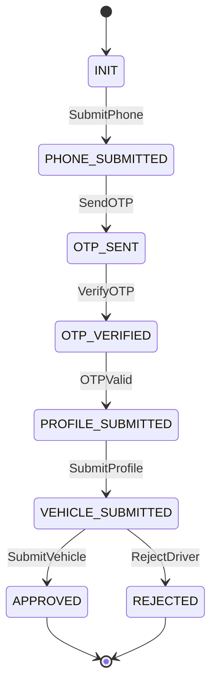
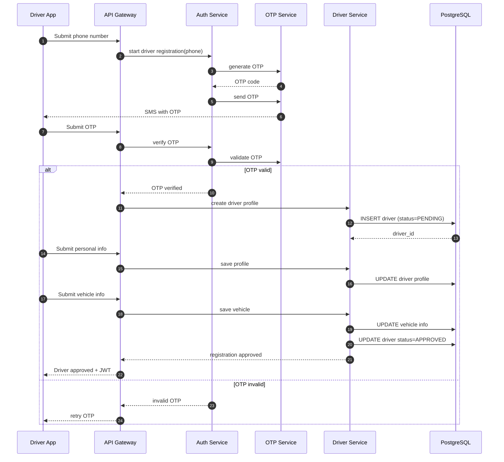

Perfect — **Driver Registration** is more complex than passenger registration, but for **MVP** it must still be **strict, minimal, and deterministic**.

Below is a **production-grade MVP design**:

* formal **state machine**
* **Mermaid state diagram**
* **Mermaid sequence diagram**
* clear separation of concerns
  No KYC overkill, no premature bureaucracy.

---

# 🧠 Driver Registration — State Machine (MVP)

## 1️⃣ States

```
INIT
PHONE_SUBMITTED
OTP_SENT
OTP_VERIFIED
PROFILE_SUBMITTED
VEHICLE_SUBMITTED
APPROVED
REJECTED
```

📌 `APPROVED` is the terminal success state.

---

## 2️⃣ Events

```
SubmitPhone
SendOTP
VerifyOTP
OTPValid
SubmitProfile
SubmitVehicle
ApproveDriver
RejectDriver
```

---

## 3️⃣ Formal transition table

Let
[
\delta : State \times Event \to State
]

| Current State     | Event         | Next State        | Notes              |
| ----------------- | ------------- | ----------------- | ------------------ |
| INIT              | SubmitPhone   | PHONE_SUBMITTED   | Phone received     |
| PHONE_SUBMITTED   | SendOTP       | OTP_SENT          | OTP generated      |
| OTP_SENT          | VerifyOTP     | OTP_VERIFIED      | OTP entered        |
| OTP_VERIFIED      | OTPValid      | PROFILE_SUBMITTED | Identity confirmed |
| PROFILE_SUBMITTED | SubmitProfile | VEHICLE_SUBMITTED | Driver info        |
| VEHICLE_SUBMITTED | SubmitVehicle | APPROVED          | Auto-approve MVP   |
| VEHICLE_SUBMITTED | RejectDriver  | REJECTED          | Policy failure     |

📌 **Manual moderation is optional but supported**

---

## 4️⃣ Mermaid — Driver Registration State Machine

Place in
`docs/architecture/state_machine/driver_registration.mmd`



---

# 🔁 Driver Registration — Sequence Diagram (MVP)

## Actors

* Driver App
* API Gateway
* Auth Service
* OTP Service
* Driver Service
* Database

---

## 5️⃣ Mermaid — Registration Sequence Diagram



---

## 6️⃣ Invariants (critical)

### 🔒 Invariant I — No approved driver without vehicle

```
state = APPROVED ⇒ vehicle_info exists
```

### 🔒 Invariant II — Phone verification first

```
state ≥ PROFILE_SUBMITTED ⇒ phone verified
```

### 🔒 Invariant III — Driver cannot accept trips unless approved

```
driver.status = APPROVED required
```

---

## 7️⃣ Minimal DB schema (MVP)

```sql
CREATE TABLE drivers (
    id UUID PRIMARY KEY,
    phone VARCHAR(20) UNIQUE NOT NULL,
    status VARCHAR(20) NOT NULL,
    created_at TIMESTAMP NOT NULL
);

CREATE TABLE driver_profiles (
    driver_id UUID PRIMARY KEY,
    name TEXT,
    license_number TEXT
);

CREATE TABLE vehicles (
    driver_id UUID PRIMARY KEY,
    model TEXT,
    plate_number TEXT
);
```

---

## 8️⃣ What is intentionally excluded (MVP discipline)

❌ Document uploads
❌ Background checks
❌ Insurance validation
❌ Driver rating
❌ Bank account

All can be added **without changing core FSM**.

---

## 9️⃣ Why this is the correct MVP

✅ Strict flow
✅ Easy to implement
✅ Easy to moderate
✅ Evolves cleanly
✅ No security shortcuts

---

## Final rule (important)

> **A driver is not part of the system until APPROVED.**

This single rule prevents 80% of early-stage bugs.
