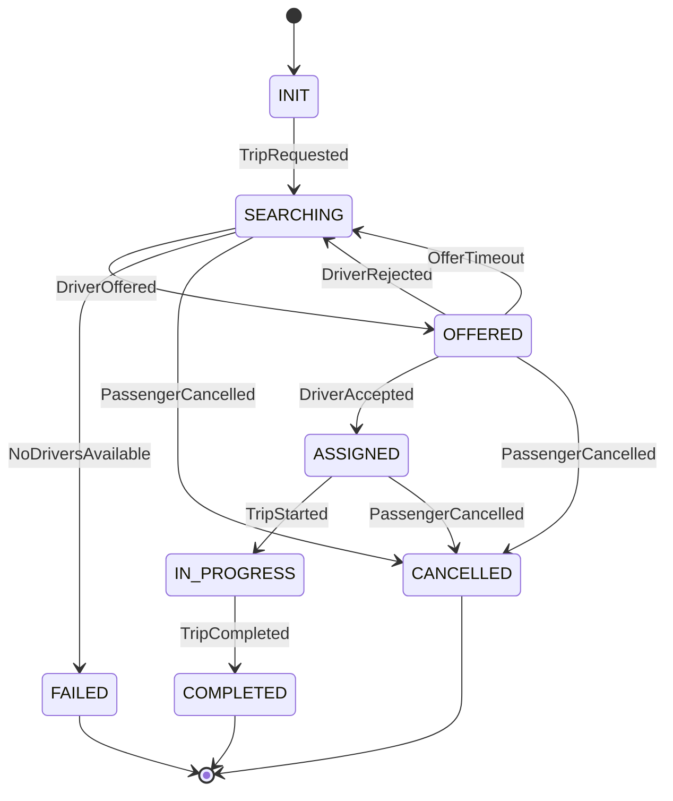

A **formal trip state machine** is the backbone of DG Do. If this is correct, everything else becomes simpler.

Below is a **strict, implementation-ready state machine** for the **DG Do MVP**, with clear states, transitions, triggers, and invariants.

---

# 🧠 DG Do — Formal Trip State Machine (MVP)

## 1️⃣ State set

We define the trip as a **finite-state machine (FSM)**.

### **States**

```
INIT
SEARCHING
OFFERED
ASSIGNED
IN_PROGRESS
COMPLETED
FAILED
CANCELLED
```

---

## 2️⃣ Events (inputs)

Events are **facts**, not commands.

```
TripRequested
DriverOffered
DriverAccepted
DriverRejected
OfferTimeout
TripStarted
TripCompleted
PassengerCancelled
NoDriversAvailable
```

---

## 3️⃣ Formal transition table

### 📐 State transition function

Let
[
\delta : State \times Event \to State
]

| Current State | Event              | Next State  | Notes            |
| ------------- | ------------------ | ----------- | ---------------- |
| INIT          | TripRequested      | SEARCHING   | Trip created     |
| SEARCHING     | DriverOffered      | OFFERED     | Offer sent       |
| OFFERED       | DriverAccepted     | ASSIGNED    | Driver locked    |
| OFFERED       | DriverRejected     | SEARCHING   | Retry            |
| OFFERED       | OfferTimeout       | SEARCHING   | Retry            |
| SEARCHING     | NoDriversAvailable | FAILED      | Terminal         |
| ASSIGNED      | TripStarted        | IN_PROGRESS | Driver confirms  |
| IN_PROGRESS   | TripCompleted      | COMPLETED   | Terminal         |
| SEARCHING     | PassengerCancelled | CANCELLED   | Terminal         |
| OFFERED       | PassengerCancelled | CANCELLED   | Terminal         |
| ASSIGNED      | PassengerCancelled | CANCELLED   | Allowed (policy) |

📌 **Forbidden transitions are implicitly invalid**

---

## 4️⃣ Mermaid — Formal State Machine Diagram

This diagram is **canonical** and should live in `/docs/architecture/state_machine/`.



---

## 5️⃣ Invariants (non-negotiable rules)

These must **always hold**, regardless of bugs or retries.

### 🔒 Invariant I — Single driver lock

```
state ∈ {ASSIGNED, IN_PROGRESS} ⇒ driver_id ≠ null
```

### 🔒 Invariant II — No reassignment after ASSIGNED

```
state ≥ ASSIGNED ⇒ driver cannot change
```

### 🔒 Invariant III — Terminal states are absorbing

```
state ∈ {COMPLETED, FAILED, CANCELLED}
⇒ no outgoing transitions
```

### 🔒 Invariant IV — SEARCHING has no driver

```
state = SEARCHING ⇒ driver_id = null
```

---

## 6️⃣ Ownership of transitions

| Component        | Allowed transitions                 |
| ---------------- | ----------------------------------- |
| Trip Service     | ALL state transitions               |
| Matching Engine  | emits DriverOffered                 |
| Driver App       | emits Accepted / Rejected / Started |
| Passenger App    | emits Cancelled                     |
| Realtime Service | transport only                      |

📌 **Only Trip Service mutates state**

---

## 7️⃣ Why this FSM is correct (and minimal)

* No redundant states
* No hidden transitions
* All failure paths explicit
* Easy to test
* Easy to persist (`state` column)
* Easy to evolve

---

## 8️⃣ Example DB representation

```sql
CREATE TYPE trip_state AS ENUM (
  'INIT',
  'SEARCHING',
  'OFFERED',
  'ASSIGNED',
  'IN_PROGRESS',
  'COMPLETED',
  'FAILED',
  'CANCELLED'
);
```

---

## 9️⃣ Evolution (without breaking FSM)

Later you can add:

* `DRIVER_ARRIVED`
* `PAYMENT_PENDING`
* `SURGE_RETRY`
* `PARTIALLY_COMPLETED`

➡️ FSM grows **horizontally**, not chaotically.

---

## Final rule (important)

> **If it’s not a state transition, it’s not business logic.**

This FSM is the **contract** between backend, apps, and realtime layer.
