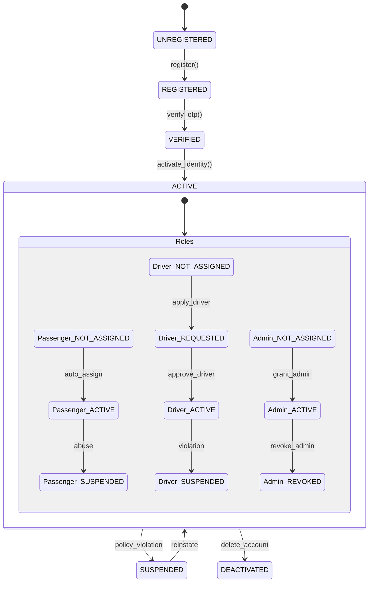
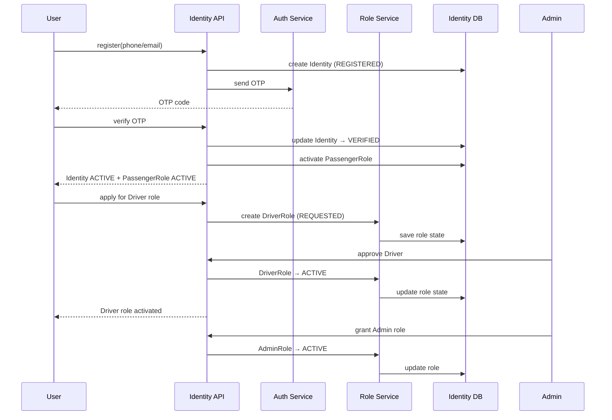

Great question — this is exactly where DG Do becomes **architecturally clean** instead of “three separate apps glued together”.

Below is a **Unified Identity FSM** that governs **Passenger / Driver / Admin** as *roles on top of a single Identity*, followed by a **Mermaid Sequence Diagram** that shows how this works at runtime.

Everything is **MVP-level**, but future-proof.

---

# 1. Core Idea: Unified Identity

**One human = one Identity**

Roles are:

* *attached*
* *activated*
* *suspended*
* *revoked*

but **identity itself is singular**.

```
Identity
 ├── PassengerRole
 ├── DriverRole
 └── AdminRole
```

No duplicated users.
No “driver_user”, “passenger_user” tables.
Just **roles with states**.

---

# 2. Unified Identity FSM (Formal)

## Identity Lifecycle (Global)

```
UNREGISTERED
   ↓
REGISTERED
   ↓
VERIFIED
   ↓
ACTIVE
   ↓
SUSPENDED / DEACTIVATED
```

This applies to **everyone**.

---

## Role Lifecycle (Per Role)

Each role has its own FSM **attached to the same Identity**.

### Generic Role FSM

```
NOT_ASSIGNED
   ↓
REQUESTED
   ↓
ACTIVE
   ↓
SUSPENDED
   ↓
REVOKED
```

---

## Combined View (Identity + Roles)

```
IDENTITY: ACTIVE
 ├─ PassengerRole: ACTIVE
 ├─ DriverRole:    NOT_ASSIGNED / REQUESTED / ACTIVE
 └─ AdminRole:     NOT_ASSIGNED / ACTIVE
```

One identity can:

* be Passenger + Driver
* be Passenger + Admin
* be all three (internally)

---

# 3. Unified Identity State Machine (Mermaid)



---

# 4. Role Semantics (MVP Rules)

### Passenger

* auto-assigned on registration
* cannot be “unassigned”, only suspended

### Driver

* explicitly requested
* requires approval
* stronger suspension rules

### Admin

* manually granted
* zero self-service
* revocable at any time

---

# 5. Unified Identity — Mermaid Sequence Diagram (MVP)

This diagram shows:

* single registration
* role attachment
* role-based behavior



---

# 6. Why This Model Is Correct (and Scales)

### ❌ Bad Model

* separate user tables
* duplicated auth
* role-specific JWTs
* role switching hacks

### ✅ This Model

* one identity
* roles as FSMs
* stateless auth
* event-driven friendly
* perfect for:

  * Kafka
  * WebSockets
  * RBAC
  * audit logs

---

# 7. JWT / Auth Token Design (MVP)

```json
{
  "sub": "identity_id",
  "roles": {
    "passenger": "ACTIVE",
    "driver": "ACTIVE",
    "admin": "NOT_ASSIGNED"
  },
  "scope": ["trip:create", "trip:accept"],
  "exp": 1234567890
}
```
