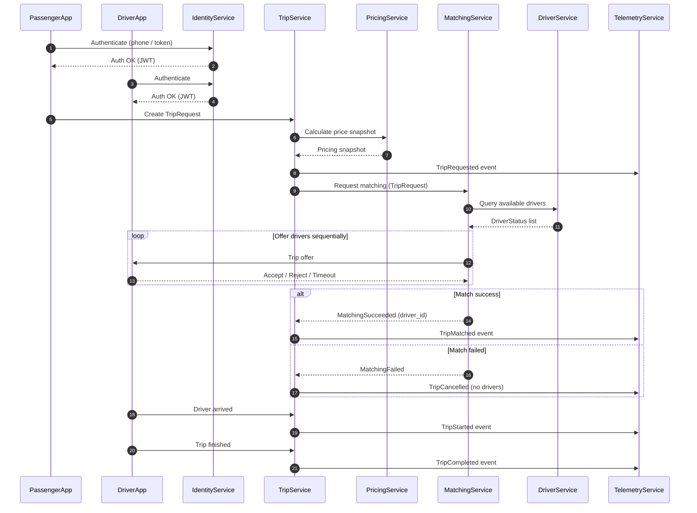

Below is an **ideal MVP-level Service Interaction Diagram** for the **DG Do project**, expressed as **one Mermaid diagram**, showing **who talks to whom, why, and in what direction**.

This diagram is **architecture-correct**, avoids circular dependencies, and matches the class → microservice mapping we already defined.

---

## DG Do — Service Interaction Diagram (MVP)

---

## How to read this diagram

### 🔹 Authority boundaries

* **TripService is authoritative**
* **MatchingService decides, but does not persist trips**
* **DriverService owns realtime availability**
* **PricingService is snapshot-based**
* **TelemetryService is write-only**

---

## Why this interaction model is correct

### ✅ No circular dependencies

* Matching never updates Trip directly
* DriverService never touches Trip state

### ✅ Failure-tolerant

* Matching failure ≠ system failure
* Driver timeouts are isolated

### ✅ Realtime-ready

* DriverApp ↔ MatchingService via WebSocket
* Everything else can be async (Kafka later)

---

## MVP simplifications (intentional)

* Pricing called **once**
* Matching is sequential (no auctions yet)
* Telemetry is fire-and-forget
* No ML feedback loop inline

All of this can be upgraded **without breaking contracts**.
