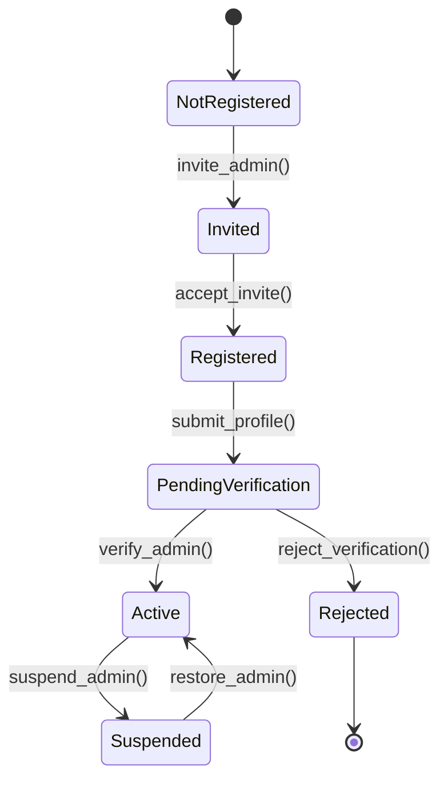
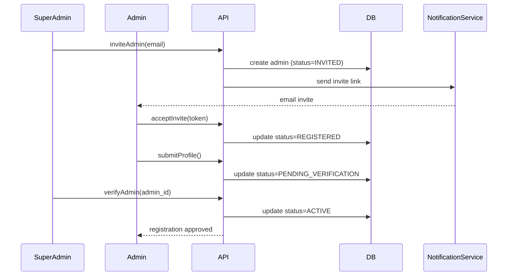

Отлично, давай зафиксируем **MVP-уровень** максимально чётко и инженерно аккуратно — так, чтобы это сразу ложилось в документацию DG Do и в код.

Ниже:
1️⃣ **State Machine** (логическая модель состояний администратора)
2️⃣ **Mermaid Sequence Diagram** (регистрация + верификация)

---

## 1️⃣ Administrator Registration — State Machine (MVP)

### 🎯 Роль администратора в MVP

Администратор — **доверенная роль**, создаваемая:

* либо **суперадмином**
* либо через **закрытую регистрацию** (invite / pre-approved email)

👉 Никакой self-signup как у пассажира — это важно для безопасности.

---

### 📌 Состояния администратора



---

### 🧠 Семантика состояний

| State               | Meaning                                 |
| ------------------- | --------------------------------------- |
| NotRegistered       | Администратора нет в системе            |
| Invited             | Создана запись + отправлено приглашение |
| Registered          | Аккаунт создан, но без прав             |
| PendingVerification | Проверка прав/документов                |
| Active              | Полноценный администратор               |
| Suspended           | Временно заблокирован                   |
| Rejected            | Регистрация отклонена                   |

---

## 2️⃣ Administrator Registration — Mermaid Sequence Diagram (MVP)

### 🎬 Сценарий: Invite → Verify → Activate



---

## 🧩 MVP API Endpoints (минимум)

```http
POST   /admin/invite
POST   /admin/accept-invite
POST   /admin/profile
POST   /admin/verify
POST   /admin/suspend
POST   /admin/restore
```

---

## 🔐 MVP Security Assumptions (важно!)

* ❌ Нет публичной регистрации
* ✅ Только whitelist / invite
* ✅ Роль `SUPER_ADMIN` выше `ADMIN`
* ✅ Admin ≠ Driver ≠ Passenger (жёсткое разделение ролей)

---

## 📌 Как это масштабируется дальше (не в MVP)

| Будущее   | Расширение               |
| --------- | ------------------------ |
| RBAC      | admin_roles, permissions |
| Audit     | admin_action_log         |
| 2FA       | mandatory for admins     |
| Geo-scope | city_admin, region_admin |
