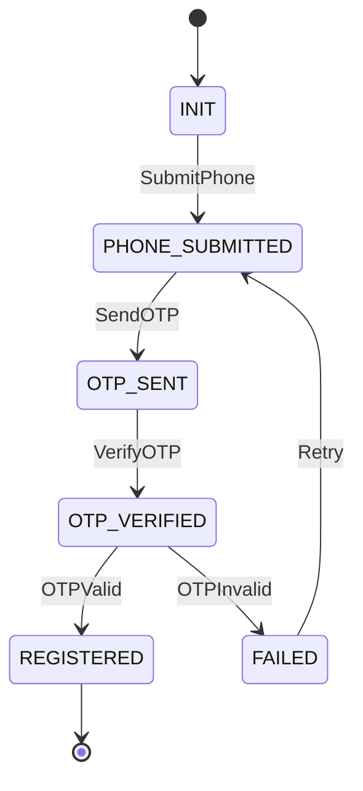
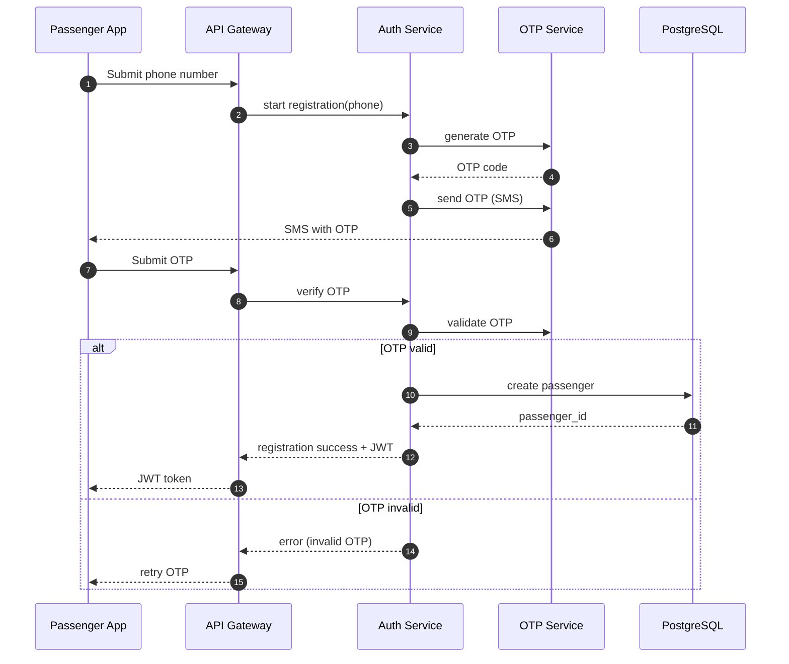

Perfect — **Passenger Registration** is a small flow, but it must be **formally correct**, because it becomes the security and identity foundation of DG Do.

Below is an **MVP-level, production-grade design**:

* a **formal state machine**
* a **Mermaid sequence diagram**
* minimal assumptions (OTP by phone)
* no overengineering

---

# 🧠 Passenger Registration — State Machine (MVP)

## 1️⃣ States

We model passenger registration as a **finite-state machine (FSM)**.

### State set

```
INIT
PHONE_SUBMITTED
OTP_SENT
OTP_VERIFIED
REGISTERED
FAILED
```

---

## 2️⃣ Events

```
SubmitPhone
SendOTP
VerifyOTP
OTPValid
OTPInvalid
RegistrationCompleted
RegistrationFailed
```

---

## 3️⃣ Formal transition table

Let
[
\delta : State \times Event \to State
]

| Current State   | Event       | Next State      | Notes                |
| --------------- | ----------- | --------------- | -------------------- |
| INIT            | SubmitPhone | PHONE_SUBMITTED | Phone received       |
| PHONE_SUBMITTED | SendOTP     | OTP_SENT        | OTP generated & sent |
| OTP_SENT        | VerifyOTP   | OTP_VERIFIED    | OTP entered          |
| OTP_VERIFIED    | OTPValid    | REGISTERED      | User created         |
| OTP_VERIFIED    | OTPInvalid  | FAILED          | Retry policy         |
| FAILED          | SubmitPhone | PHONE_SUBMITTED | Restart flow         |

📌 `REGISTERED` is a **terminal success state**

---

## 4️⃣ Mermaid — Passenger Registration State Machine

This diagram should live in
`docs/architecture/state_machine/passenger_registration.mmd`



---

# 🔁 Passenger Registration — Sequence Diagram (MVP)

## Actors

* Passenger App
* API Gateway
* Auth Service
* OTP Service
* Database

---

## 5️⃣ Mermaid — Registration Sequence Diagram



---

## 6️⃣ Invariants (must always hold)

### 🔒 Invariant I — No user without verified phone

```
state < REGISTERED ⇒ passenger_id does not exist
```

### 🔒 Invariant II — OTP is time-limited

```
OTP validity ≤ T (e.g. 60–120 seconds)
```

### 🔒 Invariant III — Idempotency

Submitting the same phone twice:

* does NOT create duplicate users
* resumes existing FSM instance

---

## 7️⃣ MVP database model (minimal)

```sql
CREATE TABLE passengers (
    id UUID PRIMARY KEY,
    phone VARCHAR(20) UNIQUE NOT NULL,
    created_at TIMESTAMP NOT NULL
);
```

OTP table can be ephemeral or Redis-based.

---

## 8️⃣ What is intentionally NOT included (MVP discipline)

❌ Email
❌ Passwords
❌ Social login
❌ CAPTCHA
❌ KYC

All can be added **without breaking the FSM**.

---

## 9️⃣ Why this design is correct

✅ Deterministic
✅ Testable
✅ Stateless API-friendly
✅ Secure enough for MVP
✅ Evolves cleanly

---

## Final rule (important)

> **Registration is a state machine, not a form.**

Once you treat it this way:

* bugs disappear
* retries are safe
* scaling is trivial
