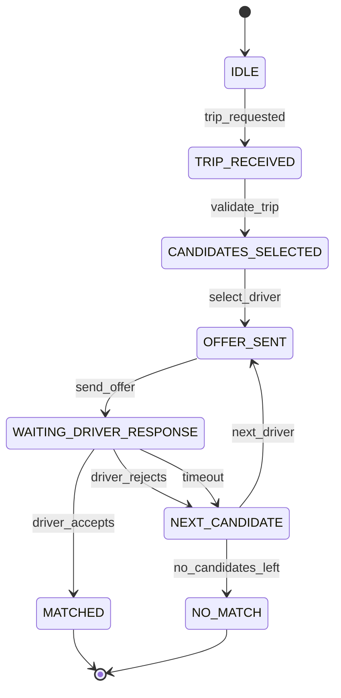
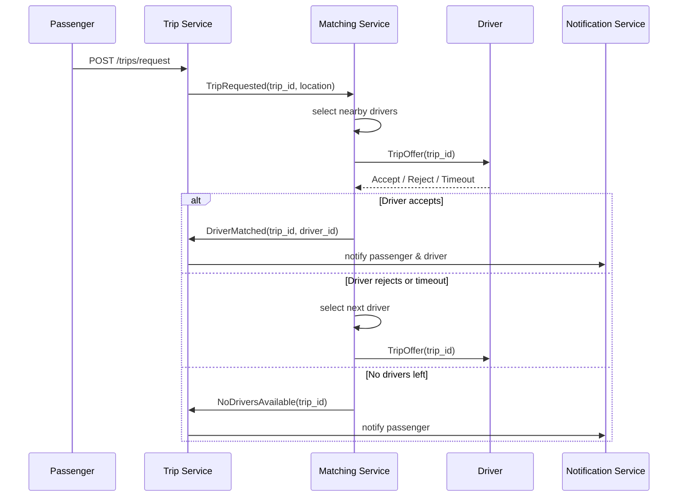

Perfect — **Matching Service** is the *brainstem* of DG Do.
Below is a **clean MVP-level formalization**: first the **State Machine**, then the **Mermaid Sequence Diagram** that shows runtime behavior.

Everything here is intentionally:

* deterministic
* debuggable
* failure-aware
* ready for Kafka/WebSockets later

---

# 1. Matching Service — Responsibility (MVP)

Matching Service is responsible for **exactly one thing**:

> Given a **TripRequest**, assign **one Driver** or return **NO_MATCH**

It does **not**:

* manage payments
* track full driver movement history
* negotiate prices
* talk to UI directly

---

# 2. Matching Service — Formal State Machine

## 2.1 Matching FSM (Trip-centric)

```
IDLE
 ↓
TRIP_RECEIVED
 ↓
CANDIDATES_SELECTED
 ↓
OFFER_SENT
 ↓
WAITING_DRIVER_RESPONSE
 ├── DRIVER_ACCEPTED → MATCHED
 ├── DRIVER_REJECTED → NEXT_CANDIDATE
 ├── TIMEOUT → NEXT_CANDIDATE
 ↓
NO_MATCH
```

---

## 2.2 States Explained

### IDLE

* No active matching process

---

### TRIP_RECEIVED

* Trip request validated
* Passenger identity checked
* Trip FSM still in `MATCHING`

---

### CANDIDATES_SELECTED

* Nearby drivers selected
* Filters applied:

  * driver online
  * driver role ACTIVE
  * no active trip
  * distance threshold

---

### OFFER_SENT

* Offer sent to **one driver**
* Offer TTL started (e.g. 10–15 seconds)

---

### WAITING_DRIVER_RESPONSE

Possible transitions:

* ACCEPT
* REJECT
* TIMEOUT

---

### NEXT_CANDIDATE

* Remove rejected/expired driver
* Retry OFFER_SENT
* Retry limit enforced

---

### MATCHED

* Driver assigned
* Matching FSM ends successfully
* Emits `DriverMatched` event

---

### NO_MATCH

* No drivers left
* Retry limit reached
* Emits `NoDriversAvailable`

---

# 3. Matching Service — State Diagram (Mermaid)



---

# 4. Matching Service — Mermaid Sequence Diagram (MVP)

This shows **real interaction** between services.



---

# 5. Timing & Retry Rules (MVP Defaults)

| Parameter           | Value (MVP) |
| ------------------- | ----------- |
| Offer TTL           | 10–15 sec   |
| Max drivers tried   | 3–5         |
| Matching total time | ≤ 60 sec    |
| Parallel offers     | ❌ No (MVP)  |

> Parallel offers = complexity explosion
> Sequential offers = debuggable MVP

---

# 6. Matching Inputs / Outputs (Events)

## Inputs

* `TripRequested`
* `DriverAccepted`
* `DriverRejected`
* `OfferTimedOut`

## Outputs

* `DriverMatched`
* `NoDriversAvailable`
* `MatchingFailed`

---

# 7. MVP Invariants (Very Important)

1. **One trip → one driver**
2. **One driver → max one active offer**
3. **Matching is stateless between retries**
4. **Trip Service remains source of truth**
5. **Matching never mutates driver state directly**

---

# 8. Why This Model Is Correct

### Compared to Uber-style systems:

* no parallel auctions
* no surge pricing logic
* no predictive ML

### But you still get:

* clean FSM
* deterministic replay
* easy audit
* simple scaling

This is the **right spine for DG Do MVP**.

---

Perfect — now we make the **Matching Service contract explicit**.
This is the **internal API** that glues Passenger, Driver, and Trip together.

Below is a **strict MVP surface**: minimal, deterministic, event-friendly.

---

# 🔗 Matching Service — MVP API Endpoints (DG Do)

> **Important**
>
> * Matching Service is **NOT public**
> * It is called by **Trip Service / Driver Service**
> * No UI, no auth UI tokens, only service-to-service auth

---

## 1. Matching Lifecycle (Core)

```
POST   /matching/start
GET    /matching/{matching_id}/status
POST   /matching/{matching_id}/cancel
```

### `POST /matching/start`

Triggered when a trip enters `MATCHING`.

```json
{
  "trip_id": "uuid",
  "pickup": { "lat": 40.283, "lon": 69.622 },
  "vehicle_type": "sedan"
}
```

Creates a **Matching Session**.

---

## 2. Driver Offer Flow

```
POST   /matching/{matching_id}/offer
POST   /matching/{matching_id}/accept
POST   /matching/{matching_id}/reject
POST   /matching/{matching_id}/timeout
```

### Semantics

* `offer` → internal action
* `accept/reject/timeout` → external signals

---

## 3. Candidate Driver Selection

```
GET    /matching/{matching_id}/candidates
POST   /matching/{matching_id}/next
```

> `next` advances FSM to the next driver.

---

## 4. Matching Result

```
GET    /matching/{matching_id}/result
```

### Possible results

```json
{
  "status": "MATCHED",
  "driver_id": "uuid"
}
```

```json
{
  "status": "NO_MATCH"
}
```

---

## 5. Matching Session Introspection (Debug)

```
GET    /matching/{matching_id}
GET    /matching/{matching_id}/history
```

Shows:

* current state
* tried drivers
* timing

---

## 6. Driver Availability Signals (Optional in MVP)

```
POST   /matching/driver/{driver_id}/online
POST   /matching/driver/{driver_id}/offline
```

> In strict MVP this may be pushed via events instead.

---

## 7. Health & Safety

```
GET    /matching/health
GET    /matching/metrics
```

Metrics:

* active matchings
* avg matching time
* success ratio

---

# 📦 Matching Service MVP API — Compact View

```
Lifecycle:
  POST /matching/start
  GET  /matching/{id}/status
  POST /matching/{id}/cancel

Offers:
  POST /matching/{id}/offer
  POST /matching/{id}/accept
  POST /matching/{id}/reject
  POST /matching/{id}/timeout

Candidates:
  GET  /matching/{id}/candidates
  POST /matching/{id}/next

Result:
  GET  /matching/{id}/result

Debug:
  GET  /matching/{id}
  GET  /matching/{id}/history

System:
  GET  /matching/health
  GET  /matching/metrics
```

---

## 🚫 Explicitly NOT in MVP

* price negotiation
* batch matching
* ML ranking
* surge logic
* parallel offers

---

## 🧠 Architectural Rules (Critical)

1. **Matching FSM is authoritative**
2. **Trip Service owns trip state**
3. **Driver Service owns driver state**
4. **Matching never talks to UI**
5. **All state changes are replayable**

---

## 🔁 Event Mapping (Recommended)

| Event             | Direction         |
| ----------------- | ----------------- |
| TripRequested     | → Matching        |
| DriverOffered     | Matching → Driver |
| DriverAccepted    | → Matching        |
| DriverRejected    | → Matching        |
| MatchingSucceeded | Matching → Trip   |
| MatchingFailed    | Matching → Trip   |

