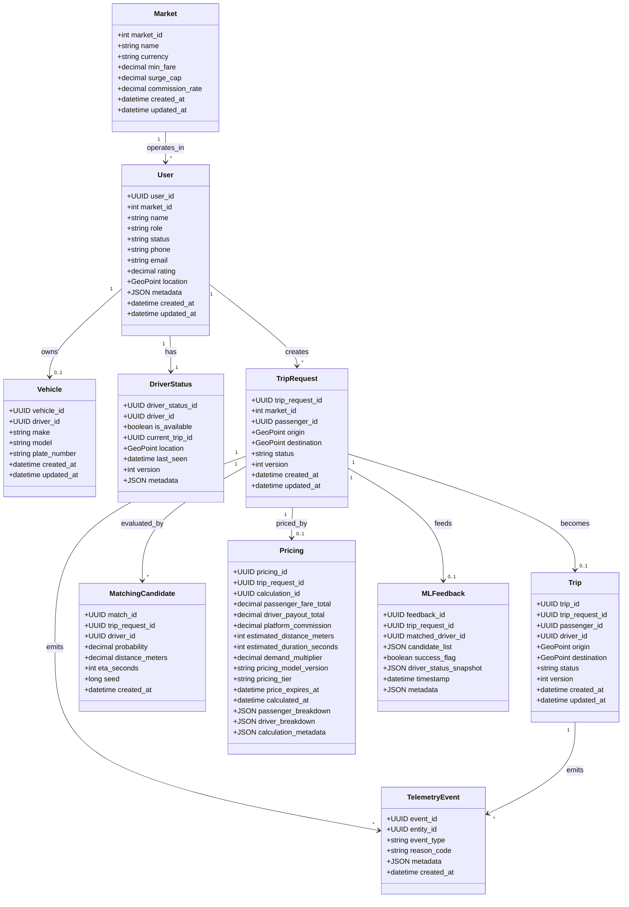

Here is a **single, unified Mermaid class diagram** for the **DG Do project (MVP level)**, combining all core domain classes into **one coherent diagram**, ready to be stored in your Git repository as a `.md` or `.mmd` file.

This diagram reflects:

* Unified Identity
* Clear separation of TripRequest vs Trip
* Explicit Matching and Pricing
* Realtime driver state
* Audit / ML readiness
  and **nothing beyond MVP**.

---



---

### How to use this in your repo

Recommended file name:

```
docs/architecture/dgdo_mvp_class_diagram.mmd
```

or inside Markdown:

```
docs/architecture/dgdo_mvp_class_diagram.md
```

Most tools (`GitHub`, `Mermaid Live`, `Obsidian`, `MkDocs`) will render it automatically.

---

Perfect, this is the **right next step**.
Below is a **clean, MVP-level mapping of classes → microservices** for **DG Do**, derived from the class diagram you already have.

No hand-waving, no over-splitting.

---

# DG Do — Class → Microservice Mapping (MVP)

## Guiding Rules (important)

1. **One service = one bounded context**
2. **Realtime ≠ transactional**
3. **Matching never owns truth**
4. **Trip lifecycle is authoritative**
5. **Identity is global**

---

# 1️⃣ Identity Service

### Responsibility

* Unified identity
* Roles (Passenger / Driver / Admin)
* Authentication & authorization

### Owns Classes

* `User`

### Exposes

* identity status
* role states
* auth tokens

### Does NOT own

* trips
* matching
* realtime location

```
Identity Service
 └── User
```

---

# 2️⃣ Driver Service

### Responsibility

* Driver-specific state
* Vehicle
* Availability

### Owns Classes

* `Vehicle`
* `DriverStatus`

### Consumes

* `User` (Identity Service)

### Emits Events

* `DriverOnline`
* `DriverOffline`
* `DriverLocationUpdated`

```
Driver Service
 ├── Vehicle
 └── DriverStatus
```

---

# 3️⃣ Trip Service (Authoritative Core)

### Responsibility

* Passenger intent
* Trip lifecycle FSM
* Final truth about trips

### Owns Classes

* `TripRequest`
* `Trip`

### Consumes

* Identity status
* Matching results

### Emits Events

* `TripRequested`
* `TripMatched`
* `TripStarted`
* `TripFinished`
* `TripCancelled`

```
Trip Service
 ├── TripRequest
 └── Trip
```

---

# 4️⃣ Matching Service (Stateless Brain)

### Responsibility

* Driver selection
* Offer / accept / retry FSM
* Deterministic decisions

### Owns Classes

* `MatchingCandidate`

### Consumes

* Driver availability
* Trip requests

### Emits Events

* `DriverOffered`
* `MatchingSucceeded`
* `MatchingFailed`

🚫 Never owns trip state.

```
Matching Service
 └── MatchingCandidate
```

---

# 5️⃣ Pricing Service

### Responsibility

* Fare calculation
* Surge logic (later)
* Price snapshots

### Owns Classes

* `Pricing`

### Consumes

* TripRequest
* Market config

```
Pricing Service
 └── Pricing
```

---

# 6️⃣ Market / Configuration Service

### Responsibility

* Geography
* Business rules
* Market-level configuration

### Owns Classes

* `Market`

```
Market Service
 └── Market
```

---

# 7️⃣ Telemetry / Audit Service

### Responsibility

* Immutable event log
* Compliance
* Debugging
* Replay

### Owns Classes

* `TelemetryEvent`

Consumes events from **all services**.

```
Telemetry Service
 └── TelemetryEvent
```

---

# 8️⃣ ML / Analytics Service (Passive, Downstream)

### Responsibility

* Learning from outcomes
* Improving ranking (later)

### Owns Classes

* `MLFeedback`

Consumes:

* Matching results
* Trip outcomes

🚫 No synchronous dependencies.

```
ML Service
 └── MLFeedback
```

---

# 🧩 Full Mapping Table (Compact)

| Microservice      | Classes Owned         |
| ----------------- | --------------------- |
| Identity Service  | User                  |
| Driver Service    | Vehicle, DriverStatus |
| Trip Service      | TripRequest, Trip     |
| Matching Service  | MatchingCandidate     |
| Pricing Service   | Pricing               |
| Market Service    | Market                |
| Telemetry Service | TelemetryEvent        |
| ML Service        | MLFeedback            |

---

# 🔗 Service Interaction Rules (Critical)

* **Trip Service → Matching Service** (request only)
* **Matching Service → Trip Service** (result only)
* **Driver Service → Matching Service** (availability signals)
* **Pricing Service → Trip Service** (snapshot only)
* **Telemetry Service ← all**

No circular ownership.
No shared databases.

---

# ⚠️ What NOT to Do (Common Mistakes)

❌ Put DriverStatus in Matching
❌ Let Matching update Trip directly
❌ Duplicate User tables
❌ Put ML in the hot path
❌ Let Admin mutate state without events

---

# 🧠 Why this architecture scales

* You can start with **3 services** (Identity, Trip, Driver)
* Add Matching as a module
* Extract later with **zero schema rewrite**
* Kafka/WebSockets fit naturally
* Game-theoretic logic plugs into Matching & Pricing

---

