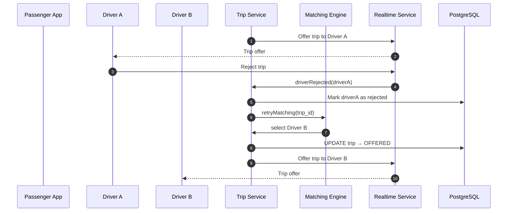
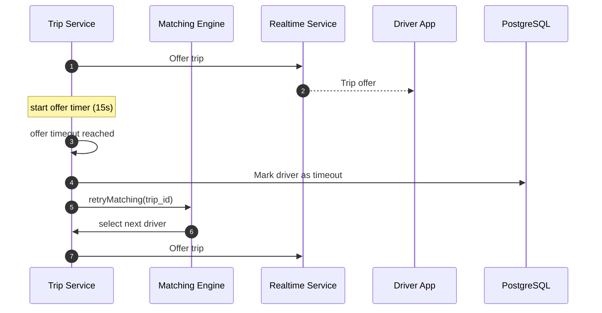
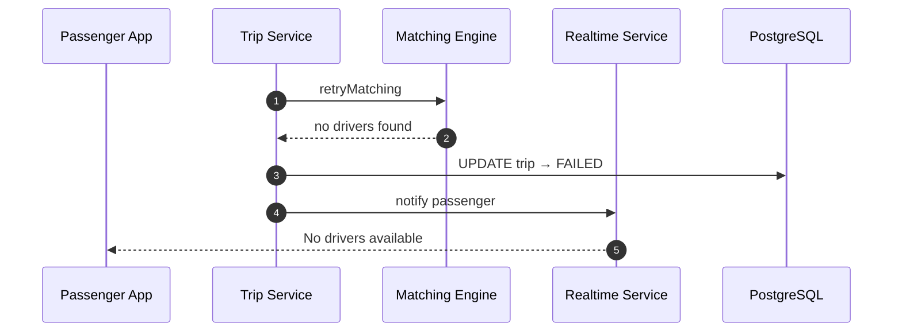

Perfect — **failure scenarios are exactly where taxi systems usually break**, so designing them explicitly is the right move.

Below is an **ideal MVP-level Mermaid Sequence Diagram** that covers **driver rejection and timeout**, without Kafka or overengineering, but in a way that naturally scales later.

---

# 🚨 DG Do — Failure Scenarios (Driver Reject / Timeout)

## Design principles (important before the diagram)

1. **Trip Service is the single source of truth**
2. **Matching Engine is stateless**
3. **Failures are normal, not exceptional**
4. **Passenger never sees internal retries**
5. **System retries automatically with limits**

---

## 🧩 Failure Scenario 1 — Driver Rejects the Trip

### Flow logic

* Driver explicitly presses **Reject**
* Trip stays in `SEARCHING`
* Matching Engine selects next best driver
* Passenger is not interrupted

---

### Mermaid — Driver Rejects



---

## 🧠 Notes

* Driver rejection is **not a failure**
* Rejected drivers are temporarily blacklisted for this trip
* Matching Engine remains simple

---

## 🧩 Failure Scenario 2 — Driver Timeout (No Response)

### Flow logic

* Driver does nothing
* Offer expires after `T = 10–15s`
* System auto-retries
* Driver may never even see it

---

### Mermaid — Driver Timeout



---

## 🧠 Notes

* Timer belongs to **Trip Service**
* WebSocket disconnect ≠ rejection
* Timeout logic must be deterministic

---

## 🧩 Failure Scenario 3 — No Drivers Available

### Flow logic

* All candidates rejected / timed out
* Retry budget exhausted
* Passenger gets clear feedback

---

### Mermaid — No Drivers Found



---

## 🧠 Correct state machine (MVP)

```
SEARCHING
   ├─ offer → OFFERED
   ├─ reject → SEARCHING
   ├─ timeout → SEARCHING
   └─ no drivers → FAILED
```

---

## 🚫 What NOT to do (common mistakes)

❌ Cancel trip on first reject
❌ Let Matching Engine manage state
❌ Use client-side timers
❌ Show retries to passenger
❌ Block system waiting for driver

---

## ✅ MVP parameters (sane defaults)

| Parameter     | Value       |
| ------------- | ----------- |
| Offer timeout | 10–15 sec   |
| Max retries   | 3–5 drivers |
| Retry delay   | 0 sec       |
| Blacklist TTL | Per trip    |

---

## 🔮 How this evolves later (without rewrite)

* Kafka for retry events
* Pricing increase after N rejects
* ML predicts reject probability
* Game theory: driver strategy modeling

---

## Final rule (important)

> **Failure handling is part of the happy path.**

If your system handles rejects and timeouts cleanly,
it will feel **fast, reliable, and calm** to users.
